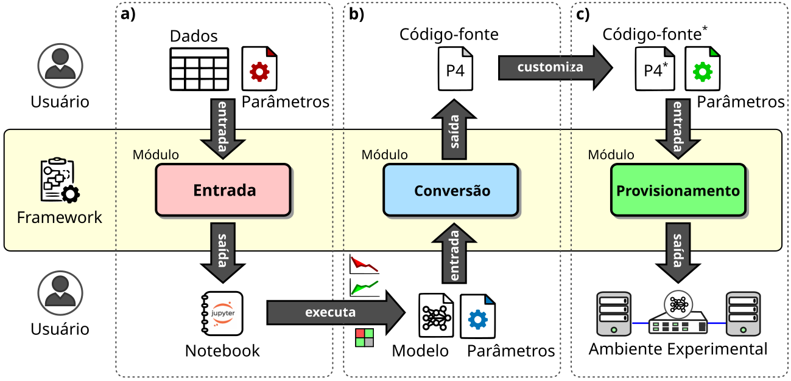

# In-NetRoadmap

This repository refers to the framework presented by "Da Teoria `a Implantação: Um Framework Metodológico para
In-Network Machine Learning em Redes Programáveis". It provides a CLI interface that researchers can use to easily train supported ML models, map them to the programmable switch pipeline and provision an experimental virtual environment.

## Pre-requisites

Because this project uses legacy ansible resources for an old vagrant box, it is required that the framework is installed under a **Python 3.9 virtual environment**. A recommended tool for creating legacy python venvs is [Pyenv](https://github.com/pyenv/pyenv). All of the framework's dependencies are handled by pip.

## Installation

The framework can be installed in development mode via pip. Dependencies are handled automatically.

```bash
git clone https://github.com/ifpb/in-netroadmap
cd in-netroadmap
pip install -e .
```

## Using the Framework

The framework's default workflow consists of using its 3 modules in order. The first module takes a CSV with training data and runs a python notebook for you to train the model. The second module requires the trained model to map it into P4 code. The third module uses the generated P4 code to provision an experimental environment for the researcher to test its trained model in an emulated network infrastructure. All modules have configurable parameters in config.toml. The following image visually describes the workflow.



The inetrm command line interface is described as follows:

```bash
inetrm init
# Creates a default config.toml file in the local directory
```

```bash
inetrm train [OPTIONS] DATA
# Runs a jupyter server with a python notebook ready to train the desired model
```

```bash
inetrm convert [OPTIONS] MODEL_FILE
# Receives a pickle binary and maps it into P4 code as configured in config.toml, aswell as generating the switch's match action table entries
```

```bash
inetrm provision [OPTIONS] P4_SOURCE TABLE
# Compiles the P4 code into a bmv2 switch, fills its tables with the generated table entries and provisions a virtual experimental environment for the researcher to test the trained model.
```

Current global options are:

- `--output-dir` - Target directory used to run the modules in
- `--help` - Help menu for desired inetrm module

## Configuration (`config.toml`)

The framework utilizes a `config.toml` file to manage parameters for machine learning training and model mapping. You can generate the default configuration file in your current directory by running `inetrm init`.

### Default Configuration

```toml
[ml]
model = "decision_tree"
features = [
  "tos",
  "window",
  "frame_size",
  "ipi",
]

[ml.parameters]
# Optional model parameters
# max_depth = 10
```

### Configuration Parameters

#### `[ml]`

This block dictates the core properties of the machine learning model you are training.

- **`model`** _(string)_: Defines the selected machine learning model.
  - **Accepted values:** `"decision_tree"`, `"naive_bayes"`, `"random_forest"`
- **`features`** _(list of strings)_: Defines the network features that will be extracted and used for training the model.
  - **Accepted values:** `"sport"`, `"dport"`, `"tos"`, `"length"`, `"id"`, `"ttl"`, `"chksum"`, `"seq"`, `"ack"`, `"window"`, `"frame_size"`, `"ipi"`, `"flags"`, `"frag"`, `"ihl"`, `"proto"`, `"dataofs"`, `"urgptr"`, `"reserved"`, `"tcp_chk"`, `"urg"`, `"ece"`, `"cwr"`, `"payload_length"`

#### `[ml.parameters]`

This block contains a set of optional, model-specific hyperparameters that will be passed directly into the training algorithm (e.g., setting `max_depth = 10` for a decision tree or random forest).
